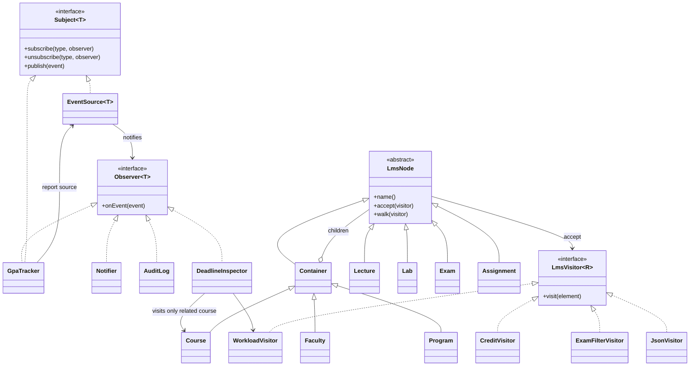

# UML Class Diagram

```mermaid
classDiagram
    class Subject~T~ {
        <<interface>>
        +subscribe(type, observer)
        +unsubscribe(type, observer)
        +publish(event)
    }
    class Observer~T~ {
        <<interface>>
        +onEvent(event)
    }
    class EventSource~T~
    Subject <|.. EventSource
    Observer <|.. GpaTracker
    Subject <|.. GpaTracker
    Observer <|.. Notifier
    Observer <|.. AuditLog
    Observer <|.. DeadlineInspector
    EventSource --> Observer : notifies
    GpaTracker --> EventSource : report source
    DeadlineInspector --> Course : visits only related course
    DeadlineInspector --> WorkloadVisitor

    class LmsNode {
        <<abstract>>
        +name()
        +accept(visitor)
        +walk(visitor)
    }
    class Container
    LmsNode <|-- Container
    Container <|-- Faculty
    Container <|-- Program
    Container <|-- Course
    LmsNode <|-- Lecture
    LmsNode <|-- Lab
    LmsNode <|-- Exam
    LmsNode <|-- Assignment
    Container o-- LmsNode : children
    class LmsVisitor~R~ {
        <<interface>>
        +visit(element)
    }
    LmsVisitor <|.. CreditVisitor
    LmsVisitor <|.. WorkloadVisitor
    LmsVisitor <|.. ExamFilterVisitor
    LmsVisitor <|.. JsonVisitor
    LmsNode --> LmsVisitor : accept
```
